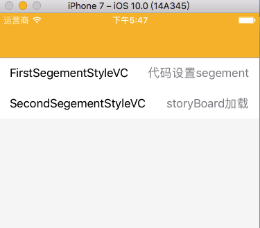
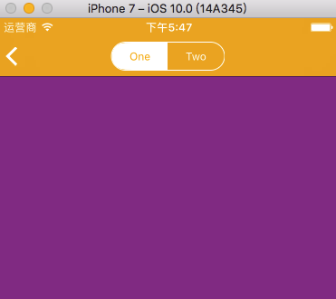
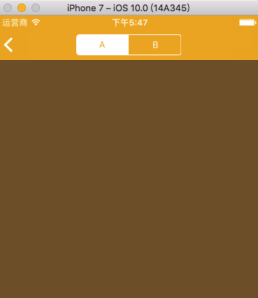

## ZQSegement
### *"导航栏上面的页签"* 代码自定义和storyboard设置  

#### 参考文档
一: [viewcontroller分别从storyboard，nib ,代码的生成方式](http://blog.sina.com.cn/s/blog_675142dc0101chtq.html)

二:[修改navigationController返回按钮颜色和文字](http://blog.csdn.net/u011096206/article/details/50606778)

三:[各位大神请教怎么改变iOS9的状态栏颜色](http://zhidao.baidu.com/link?url=Jq5TS9Tt14lg2bhQuAdK3KvBgaR-IkxGwCvq0Fm_43kHsrjSWT5XkvhBKS0iQbDhx-4YN8kK823v4Eg_YJiuNBYQVxiDzUi9xbcWcdKtY7_)